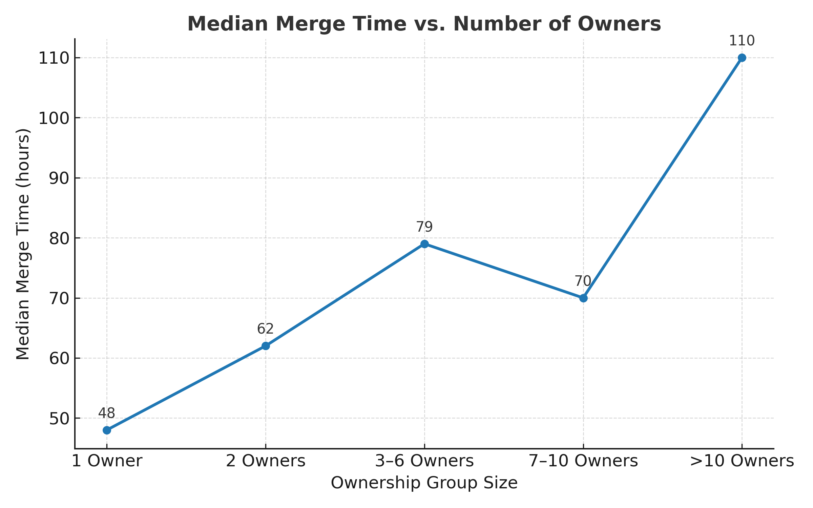

# CODEOWNERS & Review Accountability (2024–2025)

[](https://doi.org/10.5281/zenodo.17375757)

This repository reproduces the dataset and analyses used to study how **CODEOWNERS governance** affects **pull-request (PR) review latency** and **merge latency** across open-source repositories.  
The workflow combines **BigQuery SQL queries** with lightweight **Python utilities** for metadata extraction and data validation.

> ⚠️ **Data Volume & Cost Notice**  
> Running the full workflow on the GitHub Archive involves **multi-terabyte scans** and can incur **significant BigQuery costs** depending on your billing configuration.  
> For experimentation, restrict queries to a smaller date range (for example, a few months) without affecting reproducibility.  
> Always enable **cost controls or query quotas** before execution.

The full dataset and supporting files are permanently archived on Zenodo ([DOI 10.5281/zenodo.17375757](https://doi.org/10.5281/zenodo.17375757)).

---

## Repository Layout

```
code/
├── scripts/
│   └── codeowner_scan.py              # Queries the GitHub API for CODEOWNERS metadata
├── sql/
│   ├── active_repos_pr.sql
│   ├── active_repos_pr_top_2000.sql
│   ├── mergelatency_reviewlatency_final.sql
│   ├── owner_band_summary.sql
├── output/
│   ├── active_repos.csv
│   ├── active_repos_top2000.csv
│   ├── codeowners_meta.csv
│   ├── msr-final-results.csv (Hosted on Zenodo)
│   ├── owner_band_summary.csv (Hosted on Zenodo)
└── figs/
    └── merge_time_vs_owners.png

Additional Files  
* `README.md` — project documentation  
* `requirements.txt` — Python dependencies  
```

---

## Data Overview

All **output files produced from the SQL queries** are stored in the `output/` directory.  
These datasets were generated using the workflow described below and form the basis for the results reported in the accompanying analysis.

| File | Source | Description |
|------|---------|-------------|
| `active_repos.csv` | `active_repos_pr.sql` | All repositories with ≥ 1 PR event (Jan 2024 – Sep 2025) |
| `active_repos_top2000.csv` | `active_repos_pr_top_2000.sql` | The 2 000 most active repositories |
| `codeowners_meta.csv` | `codeowner_scan.py` | CODEOWNERS presence, creation date, and number of owners |
| `msr-final-results.csv` | `mergelatency_reviewlatency_final.sql` | PR-level dataset (GZ - Hosted on Zenodo - Link already provided) |
| `owner_band_summary.csv` | `owner_band_summary.sql` | Summary of governed PRs grouped by ownership size |

---

## Quickstart — Reproducing the Analysis

> **Environment**  
> All SQL queries were executed directly on the **BigQuery console** (standard SQL dialect).  
> Resulting CSVs were exported locally into the `output/` directory for validation and visualization.  
> No proprietary or restricted APIs were used.

---

### Step 1 — Identify Active Repositories
Find repositories with at least one PR event between **January 2024 and September 2025**.  
**Query:** `active_repos_pr.sql`  
**Output:** `active_repos.csv` — list of active repositories and their PR event counts.  
> Identified approximately **76 316 repositories**.

---

### Step 2 — Select the Top 2 000 Repositories
Filter the most active repositories by PR count.  
**Query:** `active_repos_pr_top_2000.sql`  
**Output:** `active_repos_top2000.csv` — top 2 000 repositories (`repo_name`, `pr_events`).

---

### Step 3 — Detect CODEOWNERS Metadata
Query the GitHub API to detect whether each repository contains a `CODEOWNERS` file, when it was created, and how many owners are listed.

```bash
export GITHUB_TOKEN="ghp_yourTokenHere"
python code/scripts/codeowner_scan.py code/output/active_repos_top2000.csv code/output/codeowners_meta.csv
```

**Output:** `codeowners_meta.csv`  
**Fields:** `repo_name, has_codeowners, codeowners_created_at, owners_count`

---

### Step 4 — Upload CODEOWNERS Metadata to BigQuery
Upload `codeowners_meta.csv` to your BigQuery project for analysis.

```sql
repo_name STRING,
has_codeowners BOOLEAN,
codeowners_created_at TIMESTAMP,
owners_count INTEGER
```

Destination example: `YOUR_PROJECT.msr2026.codeowners_meta`

---

### Step 5 — Compute PR Latency Metrics and Join
Calculate **merge latency** and **first-review latency** for each PR.  
**Query:** `mergelatency_reviewlatency_final.sql`  

**Outputs**
* `pr_merge_latency_sample` — per merged PR (`repo_name, pr_number, pr_open_ts, pr_merge_ts, hours_to_merge`)  
* `pr_review_latency_sample` — first review timestamp (`repo_name, pr_number, first_review_any_ts`)  
* `msr_final_sample` — joined dataset including CODEOWNERS metadata  

**Exported File:** `msr-final-results.csv`

---

### Step 6 — Summarize Governed PRs by Ownership Band
Aggregate PRs only where ownership existed **before the first review**, grouped by the number of owners.  
**Query:** `owner_band_summary.sql`  
**Output:** `owner_band_summary.csv`

| Ownership Band | PRs | Repositories | Median First Review (h) | Median Merge (h) | Merge IQR (h) |
|----------------|-----|---------------|--------------------------|------------------|----------------|
| 1 Owner | 57 255 | 139 | 3 | 48 | 158 |
| 2 Owners | 31 545 | 73 | 5 | 62 | 160 |
| 3–6 Owners | 110 926 | 178 | 9 | 79 | 267 |
| 7–10 Owners | 71 386 | 88 | 7 | 70 | 232 |
| > 10 Owners | 253 860 | 200 | 11 | 110 | 340 |

> This summary demonstrates that as ownership groups expand, review times lengthen and merge predictability decreases.

---

## Results Overview

The analysis reveals a clear pattern: smaller ownership groups review and merge code significantly faster, while larger groups experience longer delays and higher variability.  
This figure visualizes how merge latency scales with ownership size across all governed repositories.



*Figure: Median merge time (hours) increases as ownership groups expand, reflecting added coordination overhead.*

---

## Reproducibility

All steps are **deterministic** and reproducible using only public GitHub data from the **GitHub Archive**.  
Generated CSVs are included for verification, secondary analysis, and transparency.

---

## Data Availability

The full dataset supporting this analysis is archived on Zenodo:

📦 **Zenodo DOI:** [10.5281/zenodo.17375757](https://doi.org/10.5281/zenodo.17375757)

**Contents:**
- `msr-final-results.csv.gz` — Complete PR-level dataset
- `owner_band_summary.csv` — Aggregated metrics grouped by ownership band
  
All materials are released under a **Creative Commons Attribution 4.0 International (CC BY 4.0)** license.  
Accompanying SQL queries and scripts are licensed under **MIT** in this GitHub repository.

---

## Citation

If you use this dataset or replicate the analysis, please cite:

> Dhawan, R. (2025). *CODEOWNERS & Review Accountability (2024–2025): Open-source pull request latency dataset.*  
> Zenodo. [https://doi.org/10.5281/zenodo.17375757](https://doi.org/10.5281/zenodo.17375757)

---
